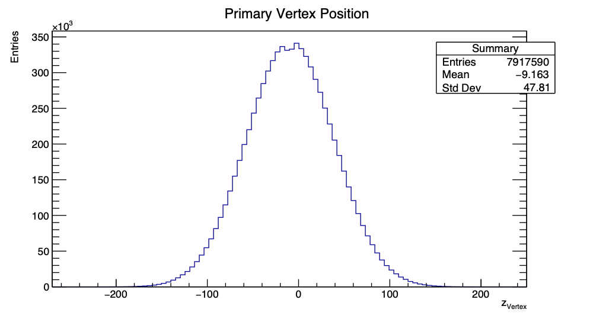
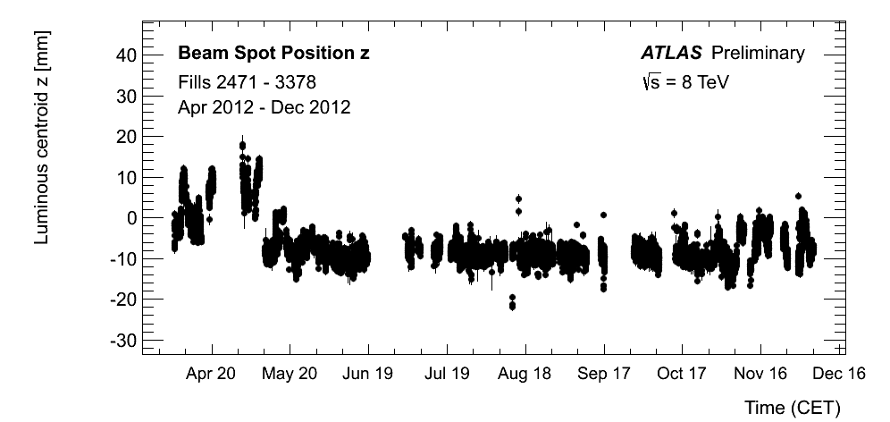
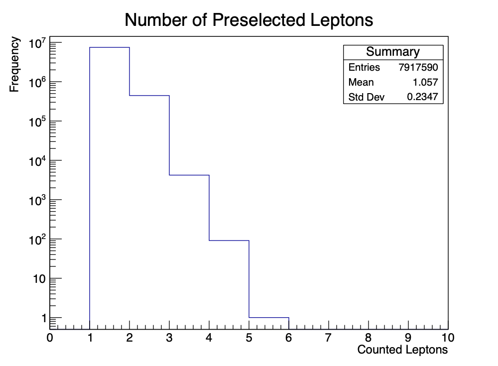
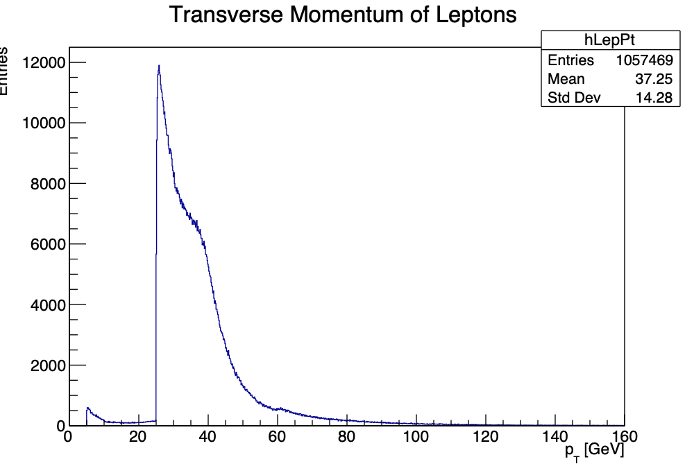
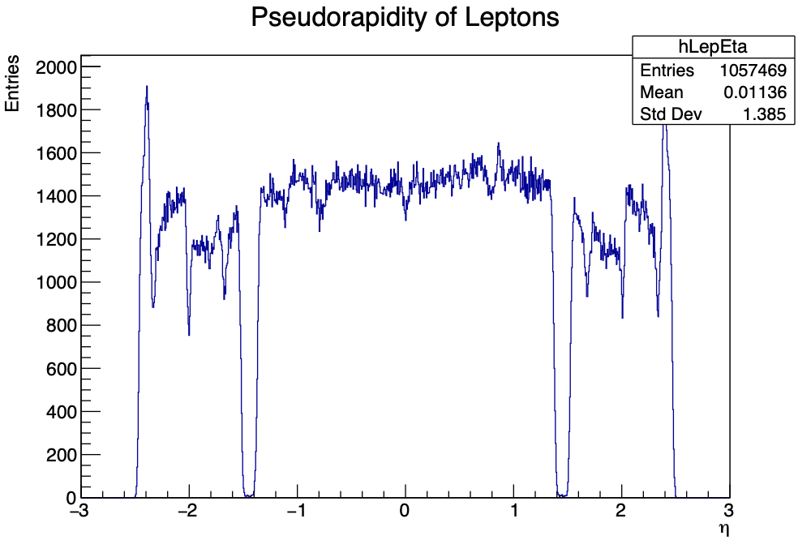
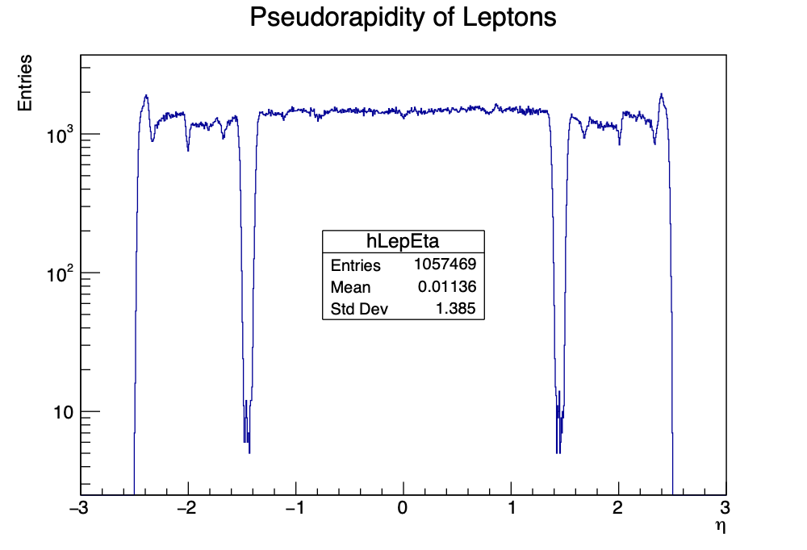
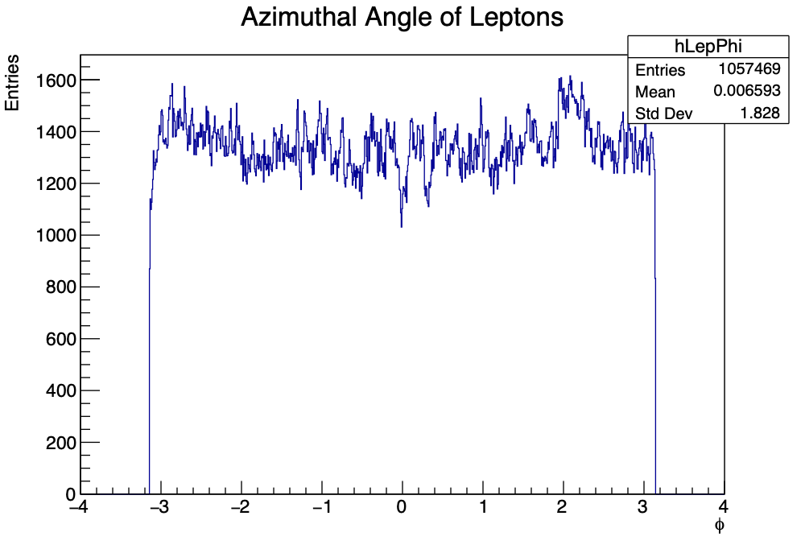

# 6.2 Getting to Know the Basics

## 2. The `vxp_z` variable

#### Plotting `vxp_z`:

`vxp_z` is a float data type \
it is the z-position of the primary vertex in mm \
z-position is along the path of the particles, z axis along the beam pipe \
center of the collider/collision is at $z=0$

The graph shows number of measurements / entries at each position. It is a histogram with number of entries vs position of collision in millimeters. \
We can read off the average position of the vertex (mean), as well as the standard deviation of the distribution.

#### Why this (mostly Gauss) distribution?
Random variable is normally distributed. \
Aim is to have collision at $z=0$, different sources of random error combine to cause Gauss distribution of position. \
Also Central Limit Theorem (CLT) means the sum of many random variables follows a distribution approaching a Gaussian.

## 3. Describe data

LHC Bunches are about 30 cm long, taking about 1 ns to travel their length. \
They make up a beam of particles. It is easier to concentrate particles more closely when they are in bunches rather than a uniform beam. \
They are spaced by 25 ns. For each beam 2808 bunches out of 3564 can contain protons.

Every filled bunch slot contains typically $N_i = O(10^{11})$ protons.

We see the distribution of the collision of two bunches.

Really there are two peaks very close to each other in the `vxp_z` graph. This could be because of the collision center moving between fills.

From website, we can see that for the 2012 run the collision center moved over time. Maybe this caused the two peaks.

Additionally, the distribution of protons inside a bunch is relevant.
A plot of this would be helpful.
If their distribution has two humps, so might the vertex position. 

## 4. `lep_n` variable

#### Plotting `lep_n`:

`lep_n` = Number of preselected leptons

The graph shows how many leptons were detected for the measurement/event. \
This is the number of counted leptons in the final state.

## 5. Describe data

We expect 1, 2 or 3 leptons in the final state of a Z decay.
depending on the specific decay process.
In leading order we expect 2 leptons.
The other numbers correspond to non-leading-order processes.
Also, neutrinos are not detected, allowing odd numbers of leptons.

Feynman diagrams of the 1, 2, 3 lepton processes go here!

The dominant process for 1-lep final:
$$ \bar u + d \overset{W^-}{\longrightarrow} e^- + \bar \nu_{e^-} $$

TODO: \
Draw Feynman diagrams for 1-lepton, 2-lepton and 3-lepton final states.

## 6. `lep_pt`, `lep_eta` and `lep_phi`

Plotting `lep_pt`, `lep_eta` and `lep_phi`:

`lep_pt` is the Transverse momentum of the lepton (transverse to what!?) \
`lep_eta` is the Pseudorapidity of the lepton \
`lep_phi` is the Azimuthal angle of the lepton

For graphing `lep_pt` and `lep_eta`, these are saved as vectors (conceptually `list`s like in `python`) because multiple leptons can be detected in one collision. Each one has its own momentum and pseudorapitity which are single components of the `lep_pt` and `lep_eta` vectors.

The histograms consolidate all of these measurements, so they can have more total entries/measurements than there were collisions.

TODO: \
How many entries do you expect and why? What are the general features of the distributions? Why are there gaps in the η distribution? Hint: Consult figure 11 and have a closer look on the tracker coverage as well as dead material distribution. Where does the steep rise around 25 GeV in the pT spectrum come from? Explain the concept of a trigger.

