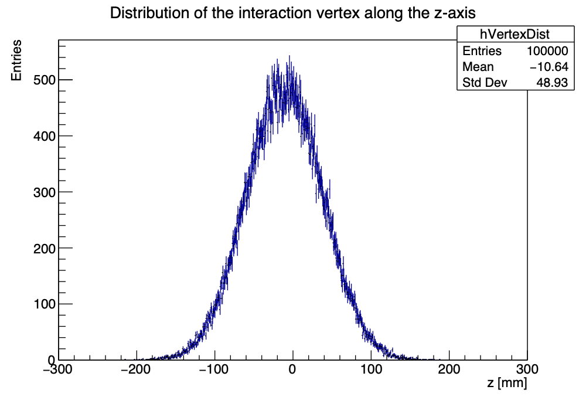
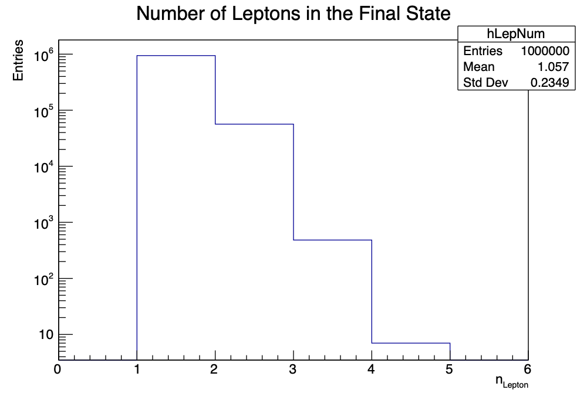
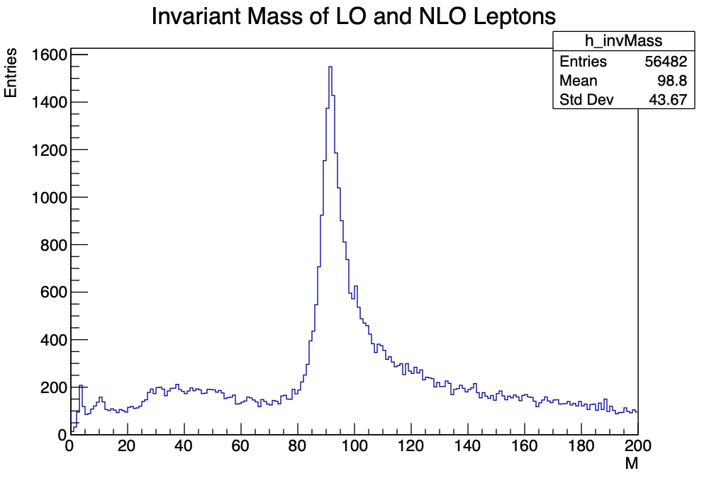
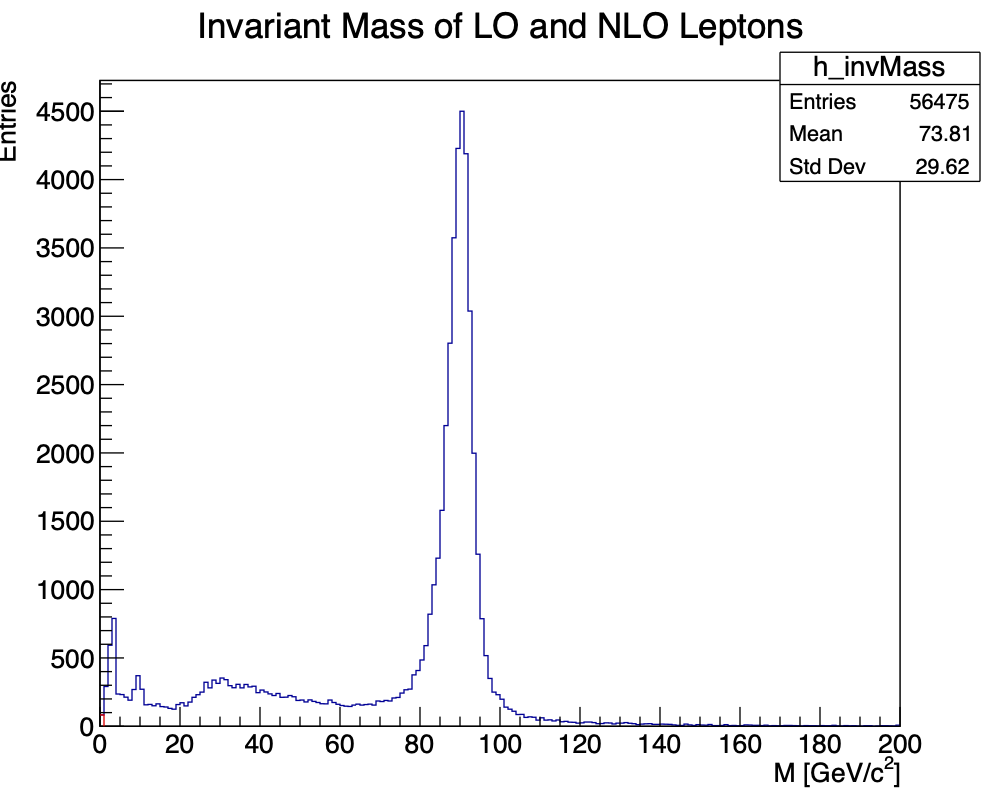
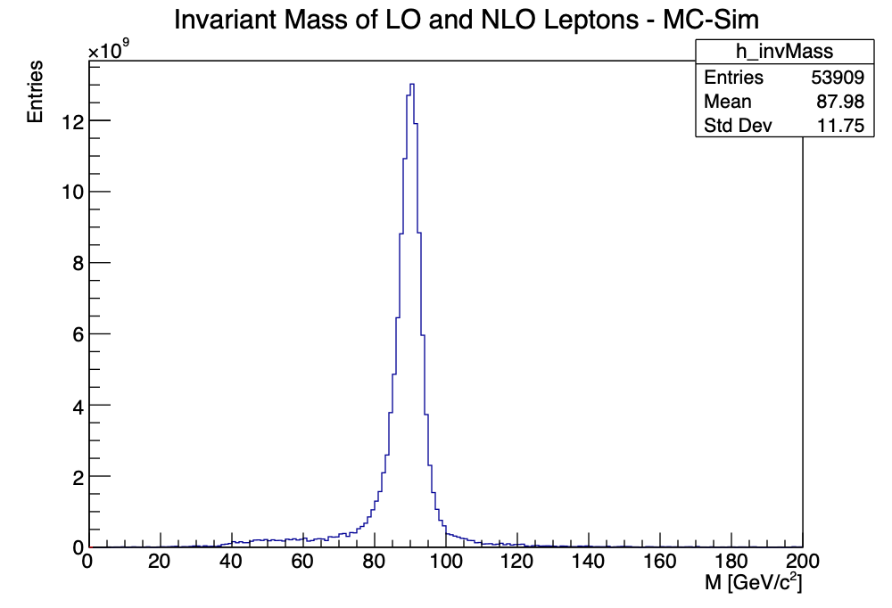

# 6.3 Automating Things

## 2. `eventloop.py`

#### What the script does:

In order:

- catch input errors
- open given file
- load ROOT tree
- make new `.root` file to save to later
- make a new histogram object with `ROOT.TH1D(...)`
- loop over all collisions:
    - in each, read out all data for the collision (check for success)
    - fill `vxp_z` for that collision into the histogram object
- write all histograms inside the new `.root` file
- by default, create a popup window/canvas with the created histogram
    - wait for user input before the popup is closed

We limited to 100,000 entries.

Converted MeV to GeV:

## 3. Invariant Mass

Rapidity:
$$ y = \frac{1}{2} \ln (\frac{E + p_z}{E - p_z}) $$
For low ratio of jet mass / jet energy:
$$ p_z \approx E \cos \theta $$
For negligible jet mass, we can use the pseudorapidity:
$$ \eta = - \ln \Big( \tan \frac{\theta}{2} \Big) \\
\eta \approx y $$

Invariant mass of the two leading leptons:

$$ m_0^2 c^2 = \frac{E^2}{c^2} - \vec{p}^2 $$

---
Measured values: $ p_T, p_z, \eta $

---
**SHOW THIS:**
$$ p_z = p_T \cdot \sinh (\eta) $$
Then:
$$ p_T^2 = p_x^2 + p_y^2 \\
p^2 = p_T^2 + p_z^2 \\
p^2 = p_T^2 \cdot (1 + \sinh^2 (\eta)) $$

Now substitute into the equation for invariant mass:

$$ m_0^2 = \frac{E^2}{c^4} - \frac{\vec{p}^2}{c^2} \\
m_0^2 = \frac{E^2}{c^4} - p_T^2 \cdot (1 + \sinh^2 (\eta)) / c^2 $$

<!--
könnte sogar stimmen!

Rearranging rapidity for E and then setting $ y = \eta$
$$ e^{2 y} = \frac{E + p_z}{E - p_z} \\
e^{2 y} (E - p_z) = E + p_z \\
-p_z e^{2 y} - p_z = E (1 - e^{2 y}) \\
-p_z (1 + e^{2 y}) = E (1 - e^{2 y}) \\
- p_z \frac{1 + e^{2 y}}{1 - e^{2 y}} = E \\
- p_z \frac{1 + e^{2 \eta}}{1 - e^{2 \eta}} = E $$

$$ m_0^2 = p_z^2 \bigg( \frac{1 + e^{2 \eta}}{1 - e^{2 \eta}} \bigg)^2 / c^4 - (p_T^2 + (p_T \cdot \sinh (\eta))^2)/c^2 $$
-->

## 4. `TLorentzVector`

Both methods do the same thing and produce exactly the same histogram.

## 5. Expected Distribution

MC simulation to find what we would expect from the data.
(Simulated distribution matches quite well to measured distribution.)

### More questions