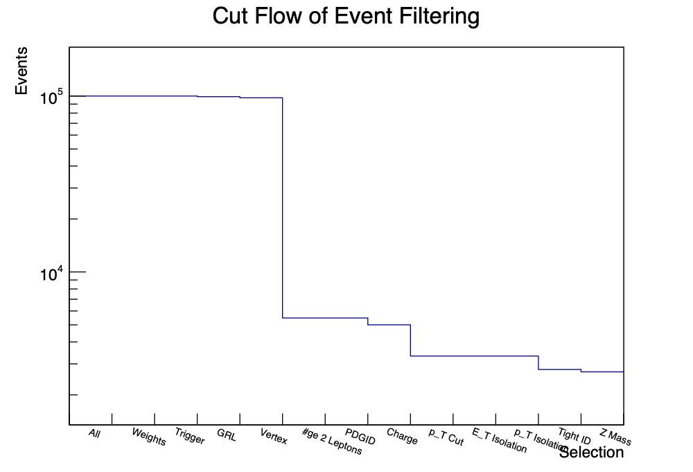

# 6.4 Selecting Events

## 1. Cut Flow Histogram

List of cuts:
- Weights: MC weighting
- Trigger: Check `trigE` or `trigM` is true (electron or muon trigger from dataset)
- GRL: Good run list, checks if event is marked as a good run (Data Quality Group assessment)
- Vertex: Check `hasGoodVertex` variable, meaning primary vertex/position of collision is well determined.
- ≥ 2 Leptons: Check that at least two leptons were detected (otherwise it is not a Z decay event)
- PDGID (Particle Data Group Identifiers): check `lep_type` variable and make sure the measured particles are leptons ($e, \mu, \tau$).
- Charge: Z Boson is neutral so the decay products must have opposite charges.
- $p_T$ Cut: leptons must have at least $25$ GeV of transverse momentum (leptons are expected to split their momenta to half of the Z mass), cutoff below this.
- Isolation Cut ($p_T$): see below
- Isolation Cut ($E$): see below
- Tight ID: We want to have data with harsher identification criteria
- Z Mass Cut: see below

The most effective cut is the cut requiring at least two leptons be produced and measured in the event. \
Next most effective is the $p_T$ cut.

## 2. Applied Cuts

We apply a series of cuts to our data and create a cut-flow histogram to show how much data is being removed/kept at each step.

#### Isolation cut:

We want events *without* other particles around our collision products. This means we should cut out events which have other energy/momentum in the same region of the detector where the lepton passed through.

This cuts out events where the lepton might have interacted with other particles and *lost energy to surroundings*, because that would not be accounted for in our calculation.

We create a histogram of $p_{Tcone}/p_T$ to see its distribution and to select a reasonable cutoff.

We restrict `Etcone20 / E` and `ptcone30 / pt` to $\leq 0.13$ 

#### $M_Z$ cut:

We restrict the invariant mass to a reasonable range:

$$ 60 \ \mathrm{GeV}/c^2 \leq M_Z \leq 120 \ \mathrm{GeV}/c^2 $$

We run the cutting process on all of the events on the following files, creating invariant mass histograms for all of them.

- `DataEgamma.root`
- `DataMuons.root`
- `mc_147770.Zee.root`
- `mc_147771.Zmumu.root`
- `mc_147772.Ztautu.root`