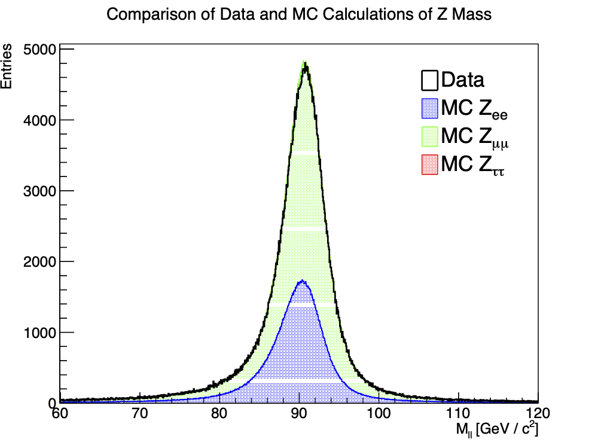

# 6.5 Comparing Data and MC

## 1. Merging Data

- We use the `hadd` utility to merge the electron and muon data files.

## 2. Plotting the Comparison

- We modify the provided script `plot.py` to produce a figure where the combined data (black) and the contributions of the MC electrons (blue), muons (green), and taus (red)
- We need to scale the MC calculations to $1\,\mathrm{fb}^{-1}$.
```python
xsec_e = 8175.7172
sumw_e = 203795455568148
xsec_m = 9953.0232
sumw_m = 225316022111048
xsec_t = 1346.6041
sumw_t = 31508540303680.9
lumi   = 1000
```
$$ \text{Scale Factor} = \frac{\text{Luminosity} \times \text{Cross-Section}}{\text{Sum of Weights}} $$



- The distribution of the merged data matches the combined distributions from the MC simulation.
- We note that the tau distribution is not in the same position, but its contribution to the MC distribution is small/negligible. Therefore, the graphs still match very well.

