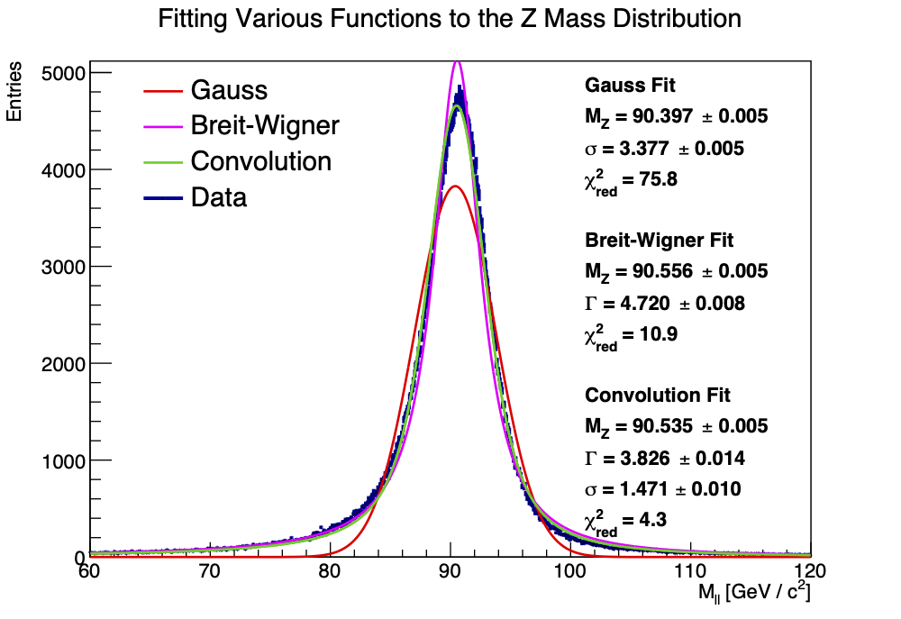

# 6.6 Fitting the Z Mass

## 1. Plotting the Fit Functions

The Breit-Wigner curve is the true distribution of the mass according to QM/SR (see $\Gamma$ explanation below).

For a real measurement (with some finite detector resolution), we also have statistical non-QM errors, which cause a Gaussian distribution (CLT).

The measured mass comes from:
$$ m_{measured} = m_{true, \ BW} + \epsilon_{error, \ G} $$

General convolution for probability:
$$ X = Y + Z $$
$$ f_X(x) = \int f_Y(y) \cdot f_Z(x - y) \ \mathrm{d}y $$

## 2. Extracting Fit Parameters

Due to mass-energy-momentum relativistic relation and finite lifetimes $\tau$, the uncertainty relation $\Delta x \ \Delta p ≥ \frac{\hbar}{2}$ can be written like $\Delta t \ \Delta E ≥ \frac{\hbar}{2}$ relates uncertainty in time with uncertainty in invariant mass.
$$ \Gamma = \frac{\hbar}{\tau}​ $$

Using the best fitting model (convolution): \
Invariant Mass:
$$ M_Z = (90.556 \pm 0.005) \ \mathrm{GeV} $$
Decay width (see above):
$$ \Gamma = (3.826 \pm 0.014) \ \mathrm{GeV} $$
Uncertainty/Standard Deviation:
$$ \sigma = (1.471 \pm 0.010) \ \mathrm{GeV} $$

---

Particle Data Group:
$$ M_Z = (91.1880 \pm 0.0020) \ \mathrm{GeV} $$
$$ \Gamma = (2.4955 \pm 0.0023) \ \mathrm{GeV} $$

---

$\sigma$-Deviations:
$$ M_Z \text{ Deviation: } 120 \ \sigma $$
$$ \Gamma \text{ Deviation: } 94 \ \sigma $$
Including the standard deviation for the $M_Z$ error:
$$ M_Z \text{ Deviation: } 0.43 \ \sigma $$
